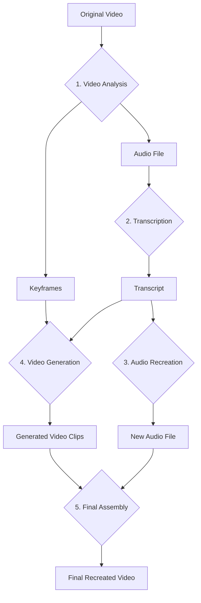

# Comprehensive Guide to Building an AI-Powered Video Recreation System

**Author:** Manus AI
**Date:** February 16, 2026

## 1. Introduction

This document provides a comprehensive guide for building a Python-based system that can take an existing video, extract its content, and recreate it with new, AI-generated visuals and voice-overs. The system leverages state-of-the-art APIs and open-source libraries to deconstruct a source video into its core components—transcript and key visual scenes—and then uses generative AI to synthesize a new version. This allows for powerful transformations, such as changing the speaker's voice, altering their appearance or gender, or even modifying the artistic style of the video, all while preserving the original narrative and scene structure.

This guide will walk through the entire process, from initial setup to the final assembly of the recreated video. It includes detailed explanations of the technologies involved, a step-by-step implementation plan with code examples, and a complete Python script to automate the workflow. The primary tools we will be using are:

- **OpenCV, MoviePy, and PySceneDetect** for video analysis, audio extraction, and intelligent keyframe detection.
- **OpenAI's Whisper** for accurate speech-to-text transcription.
- **ElevenLabs API** for generating high-quality, natural-sounding text-to-speech audio.
- **Fal.ai API** for generating new video clips from text prompts and reference images.

By the end of this guide, you will have a functional system and a deep understanding of how to integrate these powerful AI tools to create novel video content.

## 2. Prerequisites

Before you begin, ensure you have the following prerequisites in place.

### 2.1. Required Libraries

You will need to install several Python libraries. You can install them using `pip`:

```bash
sudo pip3 install opencv-python moviepy scenedetect[opencv] openai-whisper elevenlabs fal-client python-dotenv requests
```

### 2.2. API Keys

This project requires API keys for the following services. Please create accounts and obtain your keys from their respective websites:

- **ElevenLabs:** For text-to-speech generation. Get your key from the [ElevenLabs Dashboard](https://elevenlabs.io/).
- **Fal.ai:** For video generation. Get your key from the [Fal.ai Dashboard](https://fal.ai/dashboard).

**These keys are configured in this project's `.env` file** in the project root. The file contains:

- `ELEVENLABS_API_KEY` — ElevenLabs API key for text-to-speech
- `FAL_API_KEY` — Fal.ai API key for video generation

If setting up from scratch, create a file named `.env` in your project's root directory and add your keys as follows:

```
ELEVENLABS_API_KEY=your_elevenlabs_api_key
FAL_API_KEY=your_fal_api_key
```

This file will be used to securely load your API keys into the Python script.

## 3. System Architecture

The system is designed as a modular pipeline that processes the video in several distinct stages. This architecture allows for flexibility and easier debugging.

| Phase                  | Input(s)                                   | Process                                      | Output(s)                                     | Technology Used                                  |
| ---------------------- | ------------------------------------------ | -------------------------------------------- | --------------------------------------------- | ------------------------------------------------ |
| **1. Analysis**        | Original Video File                        | Extract audio and detect scene boundaries    | Audio file (`.mp3`), List of keyframes (`.jpg`) | `moviepy`, `scenedetect`, `opencv-python`        |
| **2. Transcription**   | Audio File                                 | Convert speech to text with timestamps       | Structured transcript data (JSON)             | `openai-whisper`                                 |
| **3. Audio Recreation**| Transcript Text, Voice ID                  | Generate new speech from text                | New audio file (`.mp3`)                       | `elevenlabs`                                     |
| **4. Video Generation**| Keyframes, Text Prompts                    | Generate new video clips for each scene      | List of video clip URLs                       | `fal-client`                                     |
| **5. Assembly**        | Generated Video Clips, New Audio File      | Download, concatenate clips, and add audio   | Final recreated video file (`.mp4`)           | `requests`, `moviepy`                            |

### Workflow Diagram



## 4. Step-by-Step Implementation

This section provides the detailed code and explanation for each step of the pipeline.

### Step 1: Video Analysis & Extraction

The first step is to break down the source video into its fundamental components: the audio track and a set of representative visual frames (keyframes). We use `moviepy` to extract the audio and `PySceneDetect` to intelligently identify scene changes and extract a keyframe from the middle of each scene.

```python
import os
from moviepy.editor import VideoFileClip
from scenedetect import detect, AdaptiveDetector, save_images

def analyze_video(video_path):
    """Analyzes the video to extract audio and keyframes."""
    print("Analyzing video...")
    base_name = os.path.splitext(os.path.basename(video_path))[0]
    output_dir = f"{base_name}_output"
    os.makedirs(output_dir, exist_ok=True)

    # 1. Extract Audio
    audio_path = os.path.join(output_dir, "audio.mp3")
    if not os.path.exists(audio_path):
        print("Extracting audio...")
        video_clip = VideoFileClip(video_path)
        video_clip.audio.write_audiofile(audio_path)
        video_clip.close()
    else:
        print("Audio already extracted.")

    # 2. Detect Scenes and Extract Keyframes
    keyframe_dir = os.path.join(output_dir, "keyframes")
    if not os.path.exists(keyframe_dir) or not os.listdir(keyframe_dir):
        print("Detecting scenes and extracting keyframes...")
        scene_list = detect(video_path, AdaptiveDetector())
        save_images(
            scene_list=scene_list,
            video=video_path,
            num_images=1, # One image per scene
            output_dir=keyframe_dir,
            image_name_template="$SCENE_NUMBER"
        )
    else:
        print("Keyframes already extracted.")

    return audio_path, keyframe_dir
```

### Step 2: Transcription

With the audio extracted, we can now generate a transcript. We use OpenAI's Whisper model, which provides highly accurate transcription along with timestamps for each spoken segment. These timestamps are crucial for synchronizing the new audio and video later.

```python
import whisper
import json

def transcribe_audio(audio_path):
    """Transcribes the audio to text with timestamps."""
    transcript_path = os.path.join(os.path.dirname(audio_path), "transcript.json")
    if not os.path.exists(transcript_path):
        print("Transcribing audio... This may take a moment.")
        model = whisper.load_model("base")
        result = model.transcribe(audio_path)
        with open(transcript_path, "w") as f:
            json.dump(result, f, indent=2)
        return result
    else:
        print("Transcript already exists.")
        with open(transcript_path, "r") as f:
            return json.load(f)
```

### Step 3: Audio Recreation

This is where the first part of the creative transformation happens. We take the generated transcript and use the ElevenLabs API to create a new audio track. You can choose from a wide variety of pre-made voices or even clone a voice. In this example, we'll use a pre-made voice ID.

```python
from elevenlabs.client import ElevenLabs
from elevenlabs import play

def recreate_audio(transcript, voice_id, output_dir):
    """Generates new audio from the transcript using a selected voice."""
    new_audio_path = os.path.join(output_dir, "new_audio.mp3")
    if not os.path.exists(new_audio_path):
        print(f"Recreating audio with voice {voice_id}...")
        client = ElevenLabs()
        audio = client.text_to_speech.convert(
            text=transcript["text"],
            voice_id=voice_id,
            model_id="eleven_multilingual_v2"
        )

        with open(new_audio_path, "wb") as f:
            for chunk in audio:
                f.write(chunk)
    else:
        print("New audio already generated.")
    
    return new_audio_path
```

### Step 4: Video Generation

Next, we generate the new visual content using Fal.ai. We will use an image-to-video model to maintain visual consistency. For each scene detected earlier, we use its keyframe as a reference image and a text prompt to guide the generation. The prompt can be derived from the transcript segment corresponding to that scene, with added descriptions to define the character and style.

> **Note on Character Consistency:** Maintaining a consistent character across different generated clips is a significant challenge in AI video generation. To improve consistency, use a detailed and consistent character description in every prompt (e.g., "A man with short brown hair, wearing a blue suit...") and use the same keyframe as a reference where the character appears.

```python
import fal_client

def generate_new_videos(keyframe_dir, transcript, output_dir):
    """Generates new video clips for each scene."""
    video_clips_dir = os.path.join(output_dir, "generated_clips")
    os.makedirs(video_clips_dir, exist_ok=True)
    
    print("Generating new video clips...")
    keyframe_files = sorted(os.listdir(keyframe_dir), key=lambda x: int(os.path.splitext(x)[0]))
    generated_video_paths = []

    for i, keyframe_file in enumerate(keyframe_files):
        scene_num = i + 1
        clip_path = os.path.join(video_clips_dir, f"scene_{scene_num}.mp4")
        if os.path.exists(clip_path):
            generated_video_paths.append(clip_path)
            continue

        keyframe_path = os.path.join(keyframe_dir, keyframe_file)
        # For simplicity, we use a generic prompt. In a real application,
        # you would generate a prompt from the transcript segment for this scene.
        prompt = f"A cinematic shot of a man giving a presentation. The man has short brown hair and is wearing a dark suit."

        print(f"Generating video for scene {scene_num}...")
        result = fal_client.subscribe(
            "fal-ai/luma-dream-machine", # Or another image-to-video model
            arguments={
                "prompt": prompt,
                "image_url": f"file://{os.path.abspath(keyframe_path)}",
                "aspect_ratio": "16:9",
                "expand_prompt": True
            }
        )
        
        video_url = result["video"]["url"]
        
        # Download the video
        response = requests.get(video_url)
        with open(clip_path, "wb") as f:
            f.write(response.content)
        generated_video_paths.append(clip_path)

    return generated_video_paths
```

### Step 5: Final Assembly

Finally, we assemble the individual generated video clips into a single, coherent video. We then attach the newly generated audio track to this video. `moviepy` makes this process straightforward.

```python
from moviepy.editor import concatenate_videoclips, AudioFileClip

def assemble_final_video(video_clips, new_audio_path, output_dir):
    """Assembles the final video from generated clips and new audio."""
    final_video_path = os.path.join(output_dir, "final_video.mp4")
    print("Assembling final video...")

    # Load video clips
    clips = [VideoFileClip(path) for path in video_clips]
    
    # Concatenate clips
    final_clip = concatenate_videoclips(clips, method="compose")
    
    # Add new audio
    new_audio = AudioFileClip(new_audio_path)
    final_clip = final_clip.set_audio(new_audio)
    
    # Write the final video file
    final_clip.write_videofile(final_video_path, codec="libx264", audio_codec="aac")
    
    # Close clips
    for clip in clips:
        clip.close()
    final_clip.close()
    
    print(f"Final video saved to: {final_video_path}")
    return final_video_path
```

## 5. Complete Python Script

Here is the complete script that integrates all the steps into a single, executable file. Save this as `recreate_video.py`.

```python
import os
import json
import requests
from dotenv import load_dotenv
from moviepy.editor import VideoFileClip, concatenate_videoclips, AudioFileClip
from scenedetect import detect, AdaptiveDetector, save_images
import whisper
from elevenlabs.client import ElevenLabs
import fal_client

# Load environment variables
load_dotenv()
fal_client.config(credentials=os.getenv("FAL_API_KEY"))

# --- Function Definitions from Step 4 --- #
# (Copy and paste all the function definitions from the sections above here)

def main():
    # Configuration
    video_path = "path/to/your/video.mp4"  # <--- CHANGE THIS
    elevenlabs_voice_id = "JBFqnCBsd6RMkjVDRZzb" # Example voice, find more on ElevenLabs

    # --- Execute Pipeline ---
    # 1. Analyze Video
    audio_path, keyframe_dir = analyze_video(video_path)

    # 2. Transcribe Audio
    transcript = transcribe_audio(audio_path)

    # 3. Recreate Audio
    output_dir = os.path.dirname(audio_path)
    new_audio_path = recreate_audio(transcript, elevenlabs_voice_id, output_dir)

    # 4. Generate New Videos
    generated_video_paths = generate_new_videos(keyframe_dir, transcript, output_dir)

    # 5. Assemble Final Video
    assemble_final_video(generated_video_paths, new_audio_path, output_dir)

if __name__ == "__main__":
    main()

```

To run the script, replace `"path/to/your/video.mp4"` with the actual path to your video file and execute it from your terminal:

```bash
python3 recreate_video.py
```

## 6. Customization Guide

This system is highly customizable. Here are a few ways you can modify the output:

### 6.1. Changing the Voice

To change the voice, you simply need to provide a different `voice_id` in the `main` function. You can find a list of available voices and their IDs by using the ElevenLabs API or browsing their website. For example:

```python
# To use a different voice
elevenlabs_voice_id = "another_voice_id_here"
```

### 6.2. Modifying Characters and Scenes

The visual output is controlled by the text prompts sent to Fal.ai. To change the character's appearance or the scene's setting, modify the `prompt` variable inside the `generate_new_videos` function. 

**Example: Changing to a female character in a different setting.**

```python
# Inside generate_new_videos function
prompt = f"A cinematic shot of a woman with blonde hair, wearing a red dress, speaking at a conference on a futuristic stage."
```

For more advanced visual changes, you could dynamically generate prompts based on the content of the transcript for each scene.

## 7. Conclusion

This guide has demonstrated how to build a powerful video recreation system by integrating several cutting-edge AI technologies. While the process is complex, the modular architecture allows for each component to be understood and improved upon independently. The result is a flexible and creative tool for transforming video content.

### Future Enhancements

- **Automated Prompt Generation:** Analyze the transcript and keyframes to automatically generate more descriptive and context-aware prompts.
- **Lip Sync:** Incorporate a lip-sync model to match the generated character's mouth movements to the new audio.
- **Style Transfer:** Apply specific artistic styles (e.g., anime, watercolor) to the generated video.
- **Web Interface:** Build a user-friendly web interface to allow for easier video upload, voice selection, and prompt customization.

## 8. References

1.  [MoviePy Documentation](https://zulko.github.io/moviepy/)
2.  [PySceneDetect Documentation](https://www.scenedetect.com/)
3.  [OpenAI Whisper](https://github.com/openai/whisper)
4.  [ElevenLabs API Documentation](https://elevenlabs.io/docs/api-reference/introduction)
5.  [Fal.ai Documentation](https://docs.fal.ai/)
